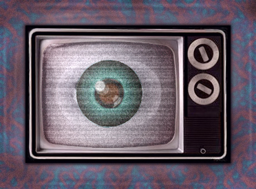
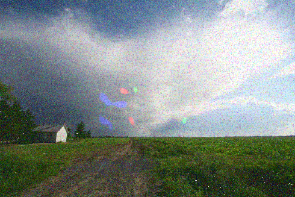

**Typ:** Persistierendes Aurasymptom — kann Wochen, Monate oder Jahre andauern. Häufig beidseitig (beide Seiten des Sichtfelds oder beide Ohren betroffen). Selten, aber gut dokumentiert.

---

## Was ist das? {#what-is-it}

Visuelles Schneerauschen ist eine persistente Sehstörung, bei der Ihr gesamtes Gesichtsfeld mit kleinen bewegten Partikeln bedeckt zu sein scheint, ähnlich wie TV-Schnee, Körnung, Schnee oder Punkte. Es ist vorhanden, ob Ihre Augen offen oder geschlossen sind, und verschwindet nicht, nachdem die Aura-Episode endet.

## Wie es sich anfühlt {#experience}

Menschen beschreiben visuelles Schneerauschen als das ständige Sehen feiner Partikel, die sich die ganze Zeit über ihr Sichtfeld bewegen. Der Schnee löscht sich nicht oder löst sich auf; stattdessen wird er zu einer permanenten Schicht über allem, was Sie sehen. Manche beschreiben es wie das Schauen durch einen Bildschirm feiner Sandpartikel, die kontinuierlich driften. Andere vergleichen es mit Fernsehrauschen oder Rauschen aus einem alten Radio – ein gleichmäßiges Feld winziger Punkte oder Bewegungslinien, die sich niemals beruhigen. Die Empfindung kann eindringlich und erschöpfend wirken, was es schwierig macht, sich auf Details zu konzentrieren oder bequem zu lesen.

*Patientenkunstwerk, das visuelles Schneerauschen / TV-Schnee darstellt — das kontinuierliche Feld bewegter Partikel, das das gesamte Gesichtsfeld bedeckt.*

*Patientenkunstwerk, das visuelles Schneerauschen darstellt, 2007.*

## Wie Betroffene es beschreiben {#patient-accounts}

> „Mit geschlossenen Augen kann ich „Die Sandkiste" sehen - das ist ein kleiner Fleck des Sichtfelds, der wie ein Feld von Sandpartikeln aussieht, die an meinem Sichtfeld vorbeigehen. Sie bewegen sich fast immer, und ich kann sie ‚steuern'."
> — *D.S.*

> „Ob du deine Augen öffnest oder sie geschlossen hältst. Du hast lange Zeit keine Dunkelheit erlebt. Du siehst immer mehr als wirklich vorhanden ist."
> — *K.O.*

> „Sehproblem: Ich schaue auf etwas, drehe meinen Kopf und sehe es dann wieder... Ich sehe etwas und sehe es dann wieder. Oder ich schaue auf etwas, bewege es und sehe es immer noch, wo ich es von bewegt habe."
> — *S.*

## Was es verschlimmert {#worsening-factors}

Visuelles Schneerauschen kann sich während oder nach Migräneanfällen verschlimmern. Viele Patienten berichten, dass visuelle Reize – helles Licht, kontrastreiche Muster, beschäftigte Umgebungen, Bildschirme – das Symptom verstärken. Stress, Müdigkeit und Schlafmangel können den Schnee bemerkbarer machen. Manche berichten von Verschlimmerung während oder um den Menstruationszyklus herum.

## Was helfen kann {#improving-factors}

Einige Patienten berichten, dass Sonnenbrillen oder Blaulicht-Filter den visuellen Unbehagen reduzieren. Ruhe, besonders visuelle Ruhe in dunkleren Umgebungen, kann Erleichterung bieten. Stressabbautechniken, Achtsamkeit und Ablenkungsstrategien helfen einigen Menschen, das Symptom zu bewältigen. Ausreichende Flüssigkeitszufuhr und Schlaf können helfen, den Schweregrad zu reduzieren. Einige Patienten berichten über bescheidene Verbesserungen mit Ansätzen der kognitiven Verhaltenstherapie.

## Verwandte Symptome {#related}

- Visuelle Perseveration (Nachbilder und Spuren)
- Photophobie (Lichtempfindlichkeit)
- Sehverlust oder verschwommenes Sehen
- Floater und andere Sehstörungen

## Klinischer Hinweis {#clinical-note}

Visuelles Schneerauschen ist das häufigste persistente Aurasymptom, das von 51 von 60 Probanden in klinischen Studien berichtet wird. Persistentes visuelles Schneerauschen sollte von einem Neurologen beurteilt werden, um Schlaganfall, halluzinogens persistierende Wahrnehmungsstörung (HPPD) oder andere Erkrankungen auszuschließen. Ein normales Gehirn-MRT ist Teil der diagnostischen Aufarbeitung bei persistenter Aura ohne Infarkt.

Wenn diese Symptome zum ersten Mal auftreten oder sich anders zeigen als bei früheren Episoden, suchen Sie eine ärztliche Abklärung auf, um andere Ursachen auszuschließen.
