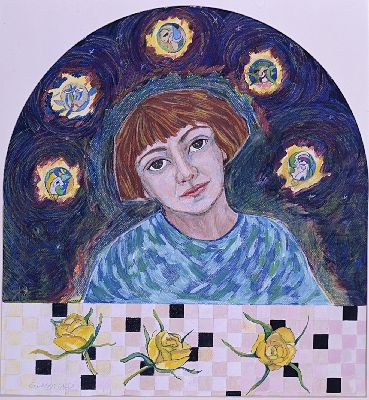
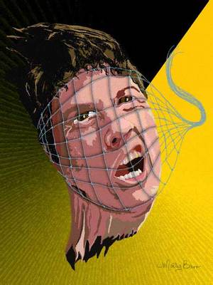

**Typ:** Transitorisches Aurasymptom — entwickelt sich typischerweise allmählich über 5–20 Minuten und klingt innerhalb von 60 Minuten vollständig ab.

---

## Was ist das? {#what-is-it}

Störungen des Träumens im Zusammenhang mit Migräne können mehrere Formen annehmen: Migränenschmerzen in deinen Träumen erleben, ungewöhnlich lebhafte oder merkwürdige Träume haben, Alpträume haben, wiederkehrende Träume haben, die vor jeder Migräne auftreten, oder Aurasymptome erleben, während du schläfst und träumst. Diese Traumstörungen sind oft ein frühes Warnzeichen, dass eine Migräne beginnt oder bald beginnt.

## Wie es sich anfühlt {#experience}

Falls du Migränenschmerzen in Träumen erlebst, könntest du plötzlich mit pochenden Kopfschmerzen aufwachen, wobei der Traum selbst die Auslösung plötzlich und rückwärts wirken lässt. Lebhafte oder seltsame Träume vor einer Migräne sind oft intensiv und emotional aufgeladen — sie könnten verstörend sein, aber nicht ganz Alpträume. Manche Menschen haben wiederkehrende Träume, die vorhersehbar vor jedem Migräneanfall auftreten und als zuverlässiges Warnzeichen dienen. Die Träume selbst werden beim Aufwachen lebhaft in Erinnerung behalten, im Gegensatz zu typischerweise vergessenen Träumen. Diese Störungen treten typischerweise in den Stunden unmittelbar vor einem Migräneanfall auf und verschwinden, sobald die Aura und die Kopfschmerzen beginnen.

*D.G., *The Migraine Dream*, 1998. Kunstwerk, das die Erfahrung von Migräne-bedingten Traumstörungen darstellt.*

*M.B., *Migraine*, 2001.*

## Wie Betroffene es beschreiben {#patient-accounts}

> "Ich würde sagen (als meine Meinung), dass du Ursache und Wirkung umgekehrt hast. Ich erinnere mich nicht oft an meine Träume, aber ich habe erlebt, mitten in der Nacht mit einem verwirrten und verstörenden Alptraum aufzuwachen, alles verursacht durch den wirklich intensiven Gedankenstrom, der meinen Migränen vorausgeht."
> — *D.C.*

> "Ich würde geneigt sein zu denken, dass es andersherum ist... dass du den schlechten Traum bekommen hast, weil eine Migräne unmittelbar bevorstand. Ich wache mit Migränen auf und frage mich immer, warum ich Migränen bekomme, wenn ich 'entspannt' sein sollte."
> — *J.C.*

> "Ich träume viel, und wenn es ein schlechter Traum ist, wache ich oft mit schrecklicher Migräne auf. Der Autor schrieb, dass Migräne oft in der Aufwachperiode beginnt. Es könnte sein, dass diese Träume bereits die Symptome der Migräne sind, genauso wie eine Aura."
> — *A.*

## Unterformen {#subtypes}

### Alpträume {#nightmares}

Verstörende oder erschreckende Träume, die auftreten, wenn die Migräne beginnt. Diese sind oft lebhaft und verstörend, dienen aber als wertvoll frühes Warnzeichen.

### Lebhafte oder seltsame Träume {#vivid-weird}

Ungewöhnlich intensive, merkwürdige oder emotional aufgeladene Träume, die sich in ihrer Lebendhaftigkeit und emotionalen Auswirkung von typischen Träumen unterscheiden.

### Migräneschmerz in Träumen {#pain-in-dreams}

Die sich entwickelnden Migränekopfschmerzen wahrnehmen, während man noch schläft, manchmal in die Traumerzählung selbst eingebunden.

### Wiederkehrende Träume als Aura {#recurring-dreams}

Der gleiche Traum oder die gleiche Traumszenario, die vorhersehbar vor Migräneanfällen auftauchen, dienen als konsistentes Aurasymptom und Warnzeichen.

### Aurasymptome während des Träumens {#aura-in-dreams}

Typische Aurasymptome (visuelle Verzerrungen, Taubheit, Schwäche) erleben, während man schläft und träumt, und sie beim Aufwachen als Migräne-Aura erkennen.

## Verwandte Symptome {#related}

- Andere Aurasymptome (visuell, sensibel, motorisch)
- Übelkeit
- Photophobie (Lichtempfindlichkeit)
- Erhöhte emotionale Empfindlichkeit

## Klinischer Hinweis {#clinical-note}

Traumstörungen sind ein wertvoll frühes Warnzeichen für viele Migräneleidende und gehen anderen Aurasymptomen oft um Stunden voraus. Das Erkennen deiner persönlichen Traummuster kann bei früher Migräne-Intervention helfen. Falls Alpträume außerhalb des Migränekontextes hartnäckig werden oder erhebliche Bedenken verursachen, besprich dies mit deinem Gesundheitsdienstleister, um Schlafstörungen oder andere Ursachen auszuschließen.

Wenn diese Symptome zum ersten Mal auftreten oder sich anders zeigen als bei früheren Episoden, suchen Sie eine ärztliche Abklärung auf, um andere Ursachen auszuschließen.
