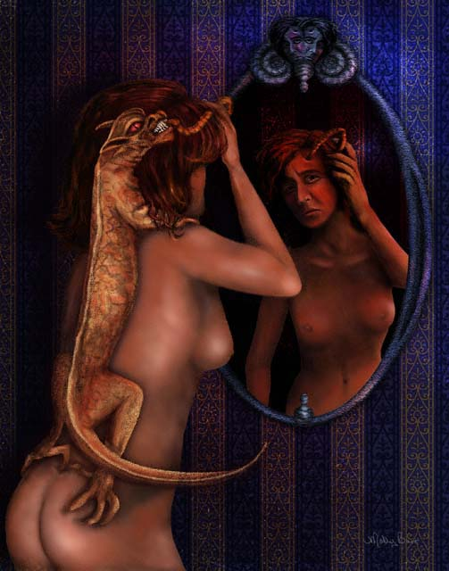

**Typ:** Transitorisches Aurasymptom — entwickelt sich typischerweise allmählich über 5–20 Minuten und klingt innerhalb von 60 Minuten vollständig ab.

---

## Was ist das? {#what-is-it}

Eine empfundene Präsenz ist das deutliche Gefühl, dass jemand oder etwas bei dir anwesend ist, obwohl du niemanden sehen oder direkt wahrnehmen kannst. Während einer Migräne-Aura könntest du das Gefühl haben, dass eine unsichtbare Präsenz im Raum ist, ein Gefühl, dass jemand mit dir kommunizieren möchte, aber zögert, oder ein Gefühl, beobachtet oder begleitet zu werden. Das ist rein eine Wahrnehmung — niemand ist wirklich da — aber das Gefühl der Präsenz wirkt in dem Moment völlig real.

## Wie es sich anfühlt {#experience}

Das Gefühl beginnt plötzlich und wirkt unmissverständlich, obwohl du bewusst weißt, dass niemand anderes physisch anwesend ist. Du könntest das Gefühl haben, dass jemand versucht, dir etwas Wichtiges zu sagen, oder mit einem inneren Konflikt über die Kommunikation kämpft. Es gibt oft eine emotionale Qualität zur Präsenz — du könntest Wärme, Besorgnis oder Entfernung spüren. Manche Menschen beschreiben, dass eine Präsenz „sich zurückzieht" oder emotional distanziert wird. Das Gefühl ist verstörend, weil es so lebhaft und emotional geladen ist, aber du kannst seine Quelle nicht identifizieren oder lokalisieren. Wie andere Aurasymptome verschwindet dieses Gefühl völlig, wenn die Aura endet.

*M.B., *Beastly Migraine*, 2002. Kunstwerk eines Patienten, das die empfundene Präsenz einer Kreatur während einer Migräne-Aura darstellt.*

## Wie Betroffene es beschreiben {#patient-accounts}

> "Ich habe das Gefühl, dass mit jemandem etwas nicht stimmt. Ich weiß nicht, was es ist oder warum ich dieses Gefühl habe. Ich habe einfach das Gefühl, dass jemand mir etwas sagen möchte, aber zögert. Ich weiß nicht, warum er es mir nicht erzählen würde. Vielleicht glaubt er, es würde mir wehtun."
> — *S.*

> "Vor nur wenigen Tagen habe ich ihre Wärme um mich herum gespürt. Heute fühle ich mich kalt."
> — *S.*

> "Während ich in den Schmerzen einer Migräne aufwachte, in meinem Traum, spürte ich, aber fühlte nicht taktil, dass eine Kreatur an mir klammerte... Ich konnte nur den Tentakel der Kreatur sehen, der durch mein Haar schlängelte und in meine Schläfe bohrte, wo der Sitz des Schmerzes war."
> — *M.B.*

## Verwandte Symptome {#related}

- Depersonalisation oder Derealisation
- Emotionale Intensivierung
- Traumstörungen
- Visuelle oder auditorische Halluzinationen

## Klinischer Hinweis {#clinical-note}

Empfundene Präsenzen während einer Migräne-Aura können emotional belastend sein, weil sie sich so real anfühlen und emotional beladen sind. Es ist wichtig, zu erkennen, dass dies ein dokumentiertes Aurasymptom ist und nicht auf eine psychiatrische Erkrankung hinweist. Falls empfundene Präsenzen außerhalb des Migränekontextes auftreten oder von anderen Symptomen begleitet werden, die dir Sorge bereiten, besprich dies mit deinem Gesundheitsdienstleister, um andere neurologische oder psychiatrische Ursachen auszuschließen.

Wenn diese Symptome zum ersten Mal auftreten oder sich anders zeigen als bei früheren Episoden, suchen Sie eine ärztliche Abklärung auf, um andere Ursachen auszuschließen.
