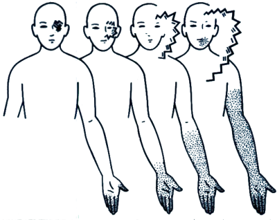

**Type:** Transitory aura symptom — typically develops gradually over 5–20 minutes and resolves within 60 minutes.

---

## What is it? {#what-is-it}

Somatosensory aura involves temporary changes in how you feel physical sensation. You may experience pins and needles (paraesthesias), numbness (hypaesthesia), or both. These sensations are fully reversible and feel the same on the affected side of your body.

## What it feels like {#experience}

Tingling and numbness typically start in one location and gradually spread to other areas over 10 to 30 minutes. You might feel a warm, prickling sensation or complete loss of feeling. One side of your body is usually affected. The sensation can be mild or quite intense, and it always resolves completely within an hour.

*Visual aura with scintillating scotoma (above) and somatosensory aura with digitolingual syndrome (below), shown in successive stages of development from left to right.*

## How patients describe it {#patient-accounts}

> "I get an aura (blindness) for half an hour, then after I get numbness on half of my body. (really freaky sometimes) It seems that you can draw a line down my body and half of my lips, tongue, face etc to one side goes tingly and numb."
> — *audrey kerves*

> "I often used to get the whole of one side of my body going numb, and then getting pins and needles in it for about an hour. Not fun."
> — *W.J.*

> "my normal aura is tingling around my mouth and cheeks, but the weirdest one I ever had was where the sensations in my hands were switched -- I felt everything that my right hand was feeling in my left hand, and vise versa."
> — *jensternal*

## Subtypes {#subtypes}

### Paraesthesias (Pins and Needles) {#paraesthesias}
A tingling, prickling sensation that often starts in the fingers and gradually spreads upward along the arm.

### Hemihypaesthesia (One-Sided Numbness) {#hemihypaesthesia}
Numbness or reduced sensation affecting one entire half of your body—you can draw a line down the middle, and one side is numb while the other feels normal.

### Digitolingual Syndrome {#digitolingual-syndrome}
Numbness starts in the fingers of one hand, gradually spreads up the arm, and then involves the nose, mouth, and lips on the same side of the body. This classic pattern takes 10 to 30 minutes to develop.

### Bilateral Paraesthesias (Both Sides) {#bilateral-paraesthesias}
Tingling or numbness affects both sides of your body simultaneously. This pattern is characteristic of basilar-type migraine and often includes other symptoms like vertigo or hearing loss.

## Related symptoms {#related}

- Visual loss and scotoma
- Speech disturbances
- Vertigo and dizziness
- Weakness or paralysis (in hemiplegic migraine)

## Clinical note {#clinical-note}

Somatosensory symptoms in typical migraine aura are always unilateral (one-sided) and reversible. Bilateral symptoms, if they occur, require urgent evaluation to rule out stroke. Seek immediate care if numbness is accompanied by facial drooping, speech difficulty, or weakness that does not resolve within an hour.

If this is the first time you experience these symptoms, or they feel different from previous episodes, seek medical evaluation to rule out other causes.
