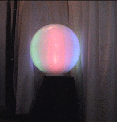
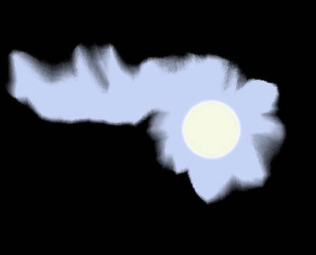

**Typ:** Transitorisches Aurasymptom — entwickelt sich typischerweise allmählich über 5–20 Minuten und klingt innerhalb von 60 Minuten vollständig ab.

---

## Was ist das? {#what-is-it}

Synästhesie ist eine vorübergehende Überkreuzung von sensorischen Bahnen, bei der die Stimulation in einem Sinne eine Erfahrung in einem anderen auslöst. Während der Migränenaura können Geräusche Farben auslösen, oder Farben können Emotionen oder Erinnerungen hervorrufen. Dies ist ein vorübergehendes Phänomen, das nur während der Aurapha auftritt.

## Wie es sich anfühlt {#experience}

Wenn Synästhesie als Migränaurasymptom auftritt, können Sie Farben sehen, wenn Sie Geräusche hören, oder ein visuelles Ansprechen auf Musik fühlen. Die Empfindungen sind lebhaft und real, obwohl Sie verstehen, dass sie Produkte Ihres Gehirns' vorübergehend veränderten Zustandes sind. Nummern oder Buchstaben können in bestimmten Farben erscheinen. Diese Erfahrung kann ziemlich angenehm oder mildly desorientierend sein, je nach den spezifischen Phänomenen.

*Das Audio-Aura-Ball: ein Objekt, das die Farbe in Reaktion auf die Tonhöhe von Musik ändert — eine visuelle Analogie für auditorisch-visuelle Synästhesie.*

*E.F., *Synästhetische Wahrnehmung von Migränekopfschmerz*, 2006. Artwork zeigt die synästhetische Erfahrung einer Migräne.*

## Wie Betroffene es beschreiben {#patient-accounts}

> "Ich hatte Migränenaura, aber das messes mein Sehen, und die Soundfarben tun es nicht."
> — *Jac*

> "Ich bin lange davon überzeugt, in meiner ungelernten Laienmeinung, dass ich einen milden Fall von Synästhesie habe, das Phänomen, das einen Stimulus in einer Modalität veranlasst, eine Reaktion in einer anderen Modalität zu evozieren. Die Ankunft von sieben Uhr wird zum Beispiel in meinem Bewusstsein durch die Farbe Braun registriert, egal ob Morgen- oder Abendstunden."
> — *B.Z.*

> "Ich kann mich damit beziehen. Ich bin ein HA-Leidender (13 Jahre), und ich habe immer Farben zu den Wochentagen assoziiert (Samstag ist schwarz, Sonntag gelb, usw.)."
> — *T.E.*

## Unterformen {#subtypes}

### Auditorisch-Visuelle Synästhesie {#auditory-visual}
Geräusche lösen visuelle Erfahrungen aus. Musik, Stimmen oder Umgebungsgeräusche produzieren Farbe oder geometrische Muster.

### Farbe-Nummern-Assoziationen {#colour-number}
Nummern, Buchstaben oder Wochentage erscheinen in bestimmten Farben. Zum Beispiel kann die Nummer 7 immer braun erscheinen, oder der Montag ist immer rot.

### Chromästhesie (Ton-Farb-Wahrnehmung) {#chromaesthesia}
Töne werden als Farben wahrgenommen. Hochfrequenztöne könnten als helle Farben erscheinen, während tiefe Töne als dunklere Töne erscheinen.

## Verwandte Symptome {#related}

- Visuelle Halluzinationen und geometrische Muster
- Depersonalisierung und verändertes Bewusstsein
- Zeitwahrnehmungsstörungen
- Visuelle Illusionen

## Klinischer Hinweis {#clinical-note}

Vorübergehende Synästhesie während der Migränenaura ist ein faszinierendes aber harmloses Phänomen. Es löst sich vollständig auf, sobald die Aurapha endet. Manche Menschen finden sie angenehm oder sogar kreativ. Wenn Synästhesie lange nach dem Ende Ihrer Migräne anhält oder außerhalb von Migräneepisoden auftritt, konsultieren Sie Ihren Arzt, um andere mögliche Ursachen zu erkunden.

Wenn diese Symptome zum ersten Mal auftreten oder sich anders zeigen als bei früheren Episoden, suchen Sie eine ärztliche Abklärung auf, um andere Ursachen auszuschließen.
