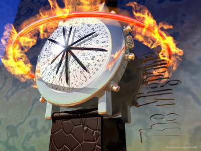

**Type:** Transitory aura symptom — typically develops gradually over 5–20 minutes and resolves within 60 minutes.

---

## What is it? {#what-is-it}

During migraine aura, your sense of how time passes can become distorted. Events may feel like they are unfolding in slow motion, or conversely, they may seem to speed up dramatically. You might also experience a sense that time itself is being repeated or duplicated.

## What it feels like {#experience}

Time distortions can be very disorienting. A few minutes might feel like hours, or an hour might pass in what feels like seconds. The world around you may seem to move at the wrong speed. This can trigger anxiety or panic, though the experience always resolves once the aura ends. Some people describe it as similar to the sensation of taking certain psychedelic drugs.

*P.D., *The Migraine*, 1999. Artwork depicting the distorted time perception experienced during migraine aura.*

## How patients describe it {#patient-accounts}

> "I suffer from migraine headaches. The feelings of a pre-migraine aura are definitely one of 'otherness', with both temporal, aural and visual disturbances. These can be quite intruiging and enjoyable during the half hour or so before the pain starts. Very occasionally I get pre-migraine auras and don't get the headache. This can be a very pleasant experience, sort of warm and fuzzy, a bit like taking drugs."
> — *Anonymous*

> "I have had the sense of time slowing down. This I have never found out why. Sometimes it happens without any migraine, whilst I'm going about normal life, everything feels 'out of sync' I get this feeling of things 'being slower' than they are happening, then speeding up with intensity."
> — *J.B.*

## Subtypes {#subtypes}

### Slowing of Time {#slowing-of-time}
Events unfold in apparent slow motion. A conversation might feel like it is happening at half speed. Your own movements may feel sluggish or delayed. Everything seems to be taking longer than it should.

### The Rushes / Zeitrafferphänomen (Time Speeding Up) {#time-speedup}
Events appear to accelerate dramatically. The world seems to move at high speed, as if you are watching a film on fast-forward. This can feel like a special effect or create a surreal, dreamlike state.

### Reduplication of Time {#time-reduplication}
Time itself may seem to be repeated or duplicated. You might feel as if an event is happening twice or that time is looping back on itself.

## Related symptoms {#related}

- Depersonalization and derealization
- Déjà vu and jamais vu
- Altered consciousness
- Visual hallucinations

## Clinical note {#clinical-note}

Time distortions are a transitory and benign part of migraine aura. They reflect temporary changes in how your brain processes temporal information. These sensations always resolve completely when the aura ends. If time perception disturbances occur outside of known migraine auras, mention this to your doctor.

If this is the first time you experience these symptoms, or they feel different from previous episodes, seek medical evaluation to rule out other causes.
