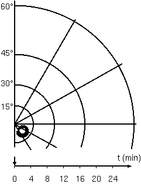
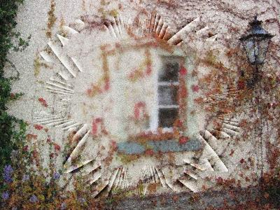
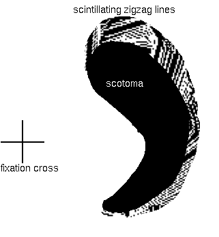

**Typ:** Transitorisches Aurasymptom — entwickelt sich typischerweise allmählich über 5–20 Minuten und klingt innerhalb von 60 Minuten vollständig ab.

---

## Was ist das? {#what-is-it}

Sehverlust während einer Migräneaura ist eine vorübergehende Verringerung oder Abwesenheit des Sehvermögens in einem Teil oder in Ihrem gesamten Gesichtsfeld. Dies kann von leichter Verschwommenheit bis zur vollständigen Blindheit reichen. Alle Sehverluste bei Migränenaura sind vollständig reversibel und lösen sich immer auf.

## Wie es sich anfühlt {#experience}

Sie können Schwierigkeiten beim Fokussieren oder leichte Verschwommenheit bemerken. Alternativ kann ein bestimmter Bereich Ihres Sichtfelds vollständig dunkel oder leer werden – Sie könnten ein Loch oder einen blinden Fleck in Ihrem normalen Gesichtsfeld sehen. In seltenen Fällen kann Ihr gesamtes Sichtfeld schwarz werden. Dies ist desorientierend, aber niemals dauerhaft. Das Sehvermögen kehrt immer innerhalb von 60 Minuten zur Normalität zurück.

*Animierte Illustration eines sich ausdehnenden positiven Skotoms — die klassische Migränenaura, die zeigt, wie der blinde Fleck über 15–30 Minuten wächst und sich über das Gesichtsfeld bewegt.*

*Kunstwerk, das ein Flimmerskotom darstellt, 2003.*

*Fortifikationsspektrum, nachgedruckt aus einem Rechenmodell. Der Zickzack-Bogen dehnt sich von der Mitte des Sichtfelds nach außen aus.*

*Eine C-förmige visuelle Migränenaura, die einen Teil einer Landschaft vollständig verdeckt — die ein absolutes Skotom darstellt.*

*Animierte visuelle Migränenaura mit Fischgrätmuster und Skotom, nachgedruckt mit Genehmigung.*

## Wie Betroffene es beschreiben {#patient-accounts}

> „Ich habe seit etwa 2,5 Jahren täglich Migränen. In letzter Zeit, in den letzten 3-4 Wochen, habe ich bemerkt, dass manchmal mein rechtes Auge sich nicht fokussieren will, egal was... Manchmal habe ich bemerkt, dass ich mich überhaupt nicht fokussieren kann, und das macht Lesen unmöglich."
> — *D.T.*

> „Ich fing an, einen blinden Fleck auf meiner linken Seite zu bekommen. Ich dachte, es wäre ein Migräne-Blindfleck..."
> — *M.W.*

> „Meine Auren waren generell entweder Skotome oder Flimmerskotome... Viele meiner Skotome flimmerten oder blinkten. Ich schätze einmal, dass sie mit einer Rate von etwa 15 pro Sekunde zu flimmern schienen."
> — *D.P.B.S.*

## Unterformen {#subtypes}

### Verschwommenes Sehen {#blurred-vision}
Geringer Sehverlust mit Schwierigkeiten beim Fokussieren auf Objekte. Ihr Sichtfeld wirkt nebelig oder unfokussiert, aber Sie können immer noch die allgemeinen Formen und Umrisse von Dingen sehen.

### Skotom (blinder Fleck) {#scotoma}
Ein bestimmter Sehverlustbereich – ein „blinder Fleck" – erscheint in Ihrem Gesichtsfeld. Der Fleck kann klein oder groß sein, und er unterbricht Ihr normales Sehen in diesem Bereich.

### Flimmerskotom (flimmernder blinder Fleck) {#scintillating-scotoma}
Ein blinder Fleck mit einer shimmernden, flimmernden oder funkelnden Grenze. Dies ist die klassische visuelle Aura. Der Fleck dehnt sich über 5 bis 20 Minuten von der Mitte des Sichtfelds nach außen aus und verschwindet dann allmählich.

### Hemianopsie (Ausfallen einer Gesichtsfeldhälfte) {#hemianopia}
Eine Hälfte Ihres Gesichtsfelds wird dunkel oder leer. Sie können Ihr gesamtes Sehen auf der rechten Seite, linken Seite, oberen Hälfte oder unteren Hälfte Ihres Gesichtsfelds verlieren. Dies ist dramatisch, aber immer vorübergehend.

### Vollständige vorübergehende Blindheit {#complete-blindness}
In seltenen Fällen wird Ihr gesamtes Sichtfeld vollständig dunkel. Sie können für mehrere Minuten bis zu einer Stunde nichts sehen. Dies ist beängstigend, aber löst sich immer vollständig auf.

### Perceptual Completion Phenomenon {#perceptual-completion}
Wenn ein Skotom erscheint, setzt sich die Textur und Farbe des Hintergrunds visuell über den blinden Fleck hinweg fort. Ihr Gehirn „füllt" den fehlenden Bereich mit dem Hintergrund aus, sodass Sie statt eines Lochs eine nahtlose Fortsetzung dessen sehen, was sich hinter dem Skotom befindet. Wenn Sie zum Beispiel lesen und ein Skotom Wörter auslöscht, kann der leere Bereich wie leeres Papier wirken statt einer schwarzen Leere.

## Verwandte Symptome {#related}

- Flimmerskotom mit geometrischen Mustern
- Visuelle Halluzinationen (Zickzacks, Funkeln)
- Visuelle Illusionen und Metamorphopsie
- Hemianopsie (Ausfallen der Gesichtsfeldhälfte)

## Klinischer Hinweis {#clinical-note}

Sehverlust, der sich innerhalb von 20 bis 60 Minuten auflöst, ist konsistent mit Migränenaura und ist gutartig. Allerdings erfordert Sehverlust, der anhält, sich verschlimmert oder von anderen neurologischen Symptomen (Schwäche, Sprachschwierigkeiten, starker Kopfschmerz) begleitet wird, eine dringende medizinische Abklärung, um einen Schlaganfall auszuschließen. Im Zweifelsfall suchen Sie sofort medizinische Hilfe auf.

Wenn diese Symptome zum ersten Mal auftreten oder sich anders zeigen als bei früheren Episoden, suchen Sie eine ärztliche Abklärung auf, um andere Ursachen auszuschließen.
